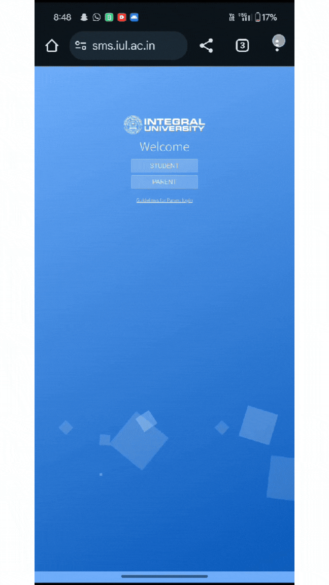
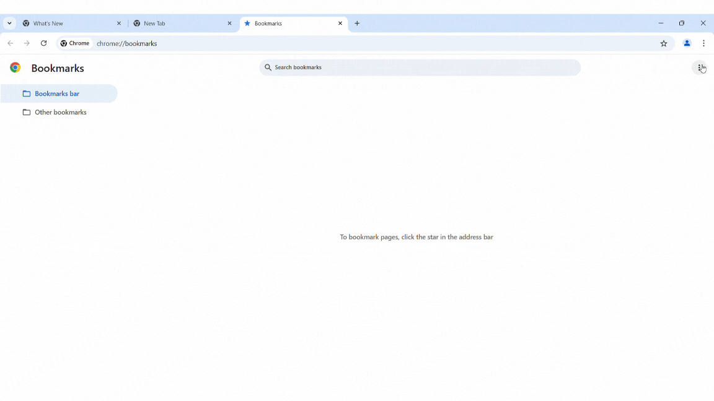
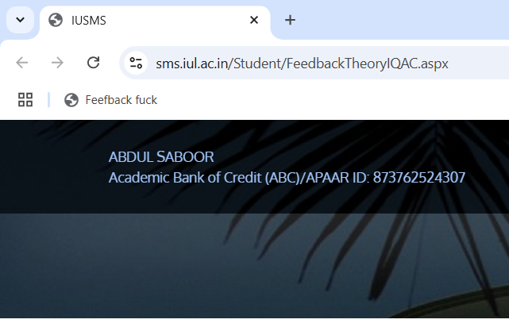
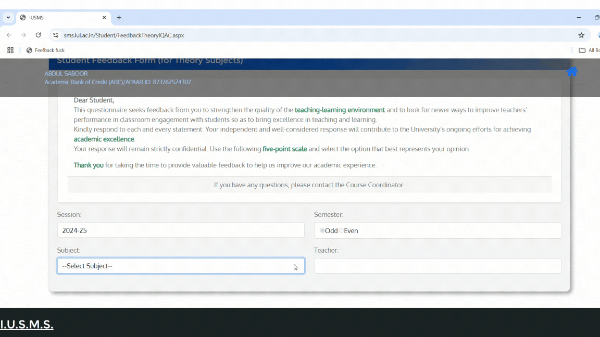

# Feedback Automation Bookmarklet  

## Description  
This bookmarklet is a tool designed to automate the process of selecting predefined answers in multiple-choice Feedback Fourms. It works by automatically selecting a specific option (`Agree` in this example) for all radio button questions on the page and attempting to submit the form.  

### Key Features  
1. Automatically selects the predefined answer (`Agree`) for all questions.  
2. Alerts the user upon completion of answer selection.  
3. Tries to click the submit button automatically and notifies the user if the button is not found.  

### Example of Working  
When the bookmarklet is executed on a feedback page:  
- It selects all the radio buttons corresponding to option `Agree`.  
- Automatically clicks the submit button (if it exists).  
- Displays an alert indicating success or failure in locating the submit button.  

## Steps:
### Step 1: Complete  Setup



### Step 2: Visit the Feedback Fourm and select Subject Code and Faculty



### Step 3: Click on Bookmark Icon
#### Note: For Android, type Bookmark Name in Adress Bar


### Congratulations, You have done the feedback Fourm in 5 Seconds



### Thank You!


---

## How to Setup  

### On Android  
1. Copy the code provided in the **Code** section below.  
2. Open your browser and create a new bookmark.  
3. Edit the bookmark and replace the URL with the provided code.  
4. Save the bookmark.  
5. Navigate to the Feedback Fourm page, type name of Bookmark in Address Bar, and tap on the Result to execute the script.  

### On PC  
1. Copy the code provided in the **Code** section below.  
2. Open your browser and add a new bookmark.  
3. Name the bookmark (e.g., "Feedback Fourm Automation").  
4. Paste the provided code into the URL field.  
5. Save the bookmark.  
6. Visit the Feedback Fourm page and click the bookmark from your bookmarks bar to execute the script.  

---

## Code  
Copy and paste the following code as the URL for your bookmark:  

```javascript
javascript:(function(){const radios=document.querySelectorAll('input[type="radio"]');radios.forEach(radio=>{if(radio.value==='rbOption_3'){radio.checked=true;}});alert("All questions have been set to 'Agree'.");const submitButton=document.getElementById('ContentPlaceHolder1_btn_Submit');submitButton?submitButton.click():alert('Submit button not found!');})();
```

---

## P.S.
I am working on a Quiz Solver for ILI, similar concept.
