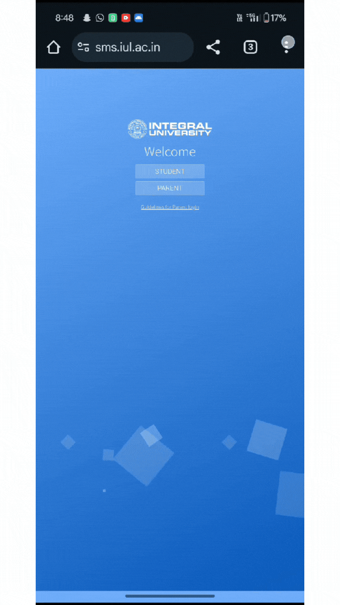
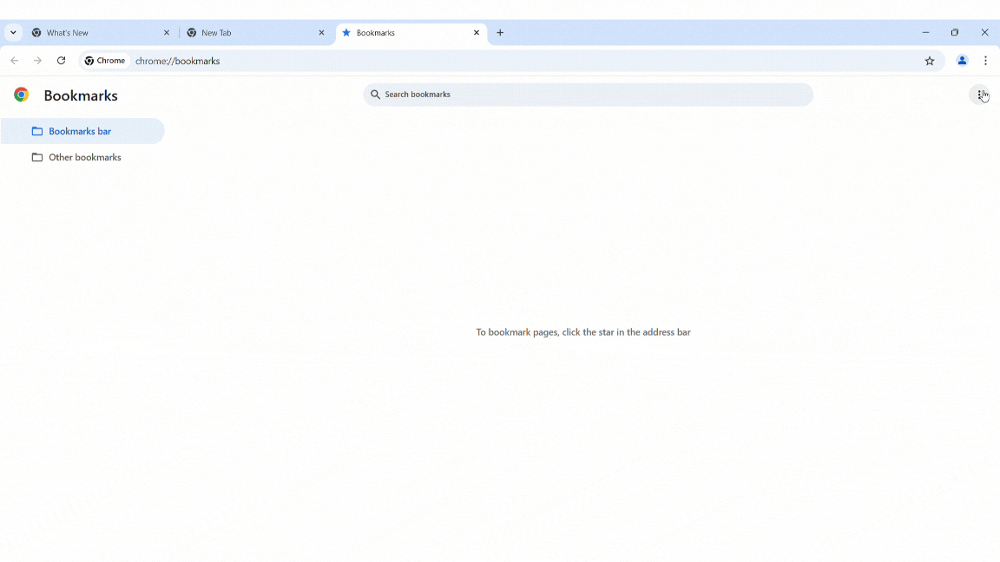
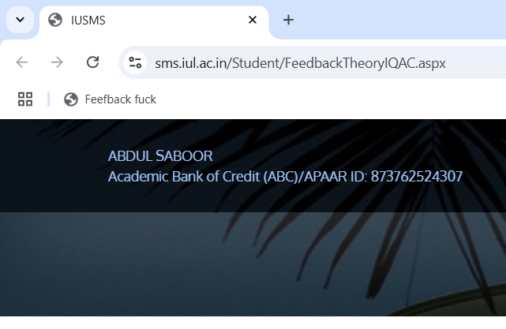

# 🚀 Feedback Automation Suite v2.0

## 📝 Description
The **Feedback Automation Suite** is an advanced bookmarklet designed for high-speed completion of multiple-choice Feedback Forms. Version 2.0 transforms the tool from a simple script into a fully automated engine that handles complex form states and multiple faculty members.

### ✨ Key Features
* **Fully Automated Loop:** Automatically iterates through every subject in the dropdown list.
* **Live Status UI:** A floating dashboard provides real-time updates on the current action (Selecting, Submitting, or Waiting).
* **Intelligent Teacher Handling:**
    * **1 Teacher:** Completes and submits instantly.
    * **2 Teachers:** Submits the first, stabilizes the page, and automatically targets the second.
    * **3+ Teachers:** Pauses for **5 seconds** (indicated by a purple status bar) to allow the user to manually select the specific teacher before proceeding.
* **Final Audit Report:** Displays a comprehensive summary at the end of the process, listing every subject and whether it was ✅ **Submitted** or ⚠️ **Already Completed**.

---

## 🛠 Setup Instructions

### 📱 On Android
1.  **Copy** the code provided in the block below.
2.  Open your browser and create a new bookmark (name it `AutoFeedback`).
3.  **Edit** the bookmark and replace the URL with the copied code.
4.  **To Run:** Go to the Feedback Form, tap the **Address Bar**, type `AutoFeedback`, and select the JavaScript result that appears.


### 💻 On PC
1.  **Copy** the code provided in the block below.
2.  Right-click your **Bookmarks Bar** and select **Add Page**.
3.  Name it `Feedback Pro` and paste the code into the **URL** field.
4.  **To Run:** Click the bookmark while on the Feedback Form page and let the script handle the rest.



---

## 💻 The Code (v2.0)

Copy and paste this entire block as your bookmark URL:

```javascript
javascript:(function(){if(document.getElementById('ai-status'))document.getElementById('ai-status').remove();var st=document.createElement('div');st.id='ai-status';st.style.cssText='position:fixed;top:10px;right:10px;padding:15px;background:#333;color:#fff;z-index:10000;border-radius:8px;font-family:sans-serif;box-shadow:0 4px 15px rgba(0,0,0,0.3);width:280px;font-size:13px;border-left:5px solid #fff;max-height:80vh;overflow-y:auto;';document.body.appendChild(st);var reportLog=[],lastAlert='';var up=function(m,c){st.innerHTML=m;if(c)st.style.borderLeftColor=c};window.alert=window.confirm=function(m){lastAlert=m;return true};var sID='ContentPlaceHolder1_ddlSubject',tID='ContentPlaceHolder1_ddlTeacherCode',bID='ContentPlaceHolder1_btn_Submit';var fs=function(sN,tN){lastAlert='';var rs=document.querySelectorAll('input[type="radio"]');for(var r=0;r<rs.length;r++){if(rs[r].value==='rbOption_3')rs[r].checked=true}var b=document.getElementById(bID);if(b&&b.offsetHeight>0){up('<b>Submitting:</b><br>'+sN+'<br><i>'+tN+'</i>','#4caf50');b.click();return 'CHECK'}return 'ALREADY'};var run=async function(){var s=document.getElementById(sID);if(!s)return;for(var i=1;i<s.options.length;i++){var elS=document.getElementById(sID),subName=elS.options[i].text;up('<b>Selecting Subject</b><br>'+subName,'#2196f3');elS.selectedIndex=i;elS.dispatchEvent(new Event('change',{bubbles:true}));await new Promise(r=>setTimeout(r,2500));var elT=document.getElementById(tID);if(elT&&elT.options.length>1){var tc=elT.options.length-1,t1Name=elT.options[1].text;elT.selectedIndex=1;elT.dispatchEvent(new Event('change',{bubbles:true}));await new Promise(r=>setTimeout(r,1200));var res=fs(subName,t1Name);if(res==='CHECK'){await new Promise(r=>setTimeout(r,4000));if(lastAlert.toLowerCase().includes('already')){reportLog.push('⚠️ Already Submitted: '+subName+' ('+t1Name+')')}else{reportLog.push('✅ Submitted: '+subName+' ('+t1Name+')')}}else{reportLog.push('⚠️ Already Submitted: '+subName+' ('+t1Name+')')}if(tc>=2){up('<b>Stabilizing for T2...</b>','#ff9800');elS.selectedIndex=0;elS.dispatchEvent(new Event('change',{bubbles:true}));await new Promise(r=>setTimeout(r,2000));elS.selectedIndex=i;elS.dispatchEvent(new Event('change',{bubbles:true}));var check=0;while(document.getElementById(sID).selectedIndex!==i&&check<10){document.getElementById(sID).selectedIndex=i;await new Promise(r=>setTimeout(r,500));check++}await new Promise(r=>setTimeout(r,2000));elT=document.getElementById(tID);if(tc===2){var t2Name=elT.options[2].text;elT.selectedIndex=2;elT.dispatchEvent(new Event('change',{bubbles:true}));await new Promise(r=>setTimeout(r,1200));var res2=fs(subName,t2Name);if(res2==='CHECK'){await new Promise(r=>setTimeout(r,4000));if(lastAlert.toLowerCase().includes('already')){reportLog.push('⚠️ Already Submitted: '+subName+' ('+t2Name+')')}else{reportLog.push('✅ Submitted: '+subName+' ('+t2Name+')')}}else{reportLog.push('⚠️ Already Submitted: '+subName+' ('+t2Name+')')}}else{for(var sec=5;sec>0;sec--){up('<b>3+ Teachers!</b><br>'+subName+'<br>Pick next in <b>'+sec+'s</b>...','#9c27b0');await new Promise(r=>setTimeout(r,1000))}var selIdx=elT.selectedIndex===0?2:elT.selectedIndex,selTN=elT.options[selIdx].text;elT.selectedIndex=selIdx;elT.dispatchEvent(new Event('change',{bubbles:true}));await new Promise(r=>setTimeout(r,1200));var res3=fs(subName,selTN);if(res3==='CHECK'){await new Promise(r=>setTimeout(r,4000));if(lastAlert.toLowerCase().includes('already')){reportLog.push('⚠️ Already Submitted: '+subName+' ('+selTN+')')}else{reportLog.push('✅ Submitted: '+subName+' ('+selTN+')')}}else{reportLog.push('⚠️ Already Submitted: '+subName+' ('+selTN+')')}}}}}var rHTML='<b>📊 Final Audit Report</b><hr><div style="font-size:11px;text-align:left;">'+reportLog.join('<br>')+'</div>';up(rHTML,'#4caf50');var c=document.createElement('div');c.innerText='Dismiss [X]';c.style.cssText='margin-top:10px;cursor:pointer;font-weight:bold;color:#aaa;';c.onclick=()=>st.remove();st.appendChild(c)};run()})();
```

---

## ⚡ Upcoming
I am currently working on a **Quiz Solver for ILI** utilizing similar automated logic. Check back soon for updates!

---


## 📖 Usage Guide

Check the video below to see how the automation works in real-time.

<video src="https://github.com/saboorium/fuckIULfeedbacks/raw/main/images/usage-guide.mp4" controls="controls" style="max-width: 100%;">
  Your browser does not support the video tag.
</video>

---

### 🛠 Quick Steps
1. **Open** the Feedback Forum.
2. **Click** your bookmarklet.
3. **Wait** for the script to finish (Watch the status box).
4. **Review** the Final Audit Report.
